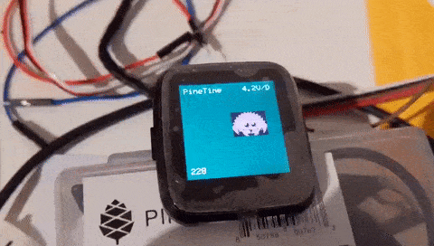

# Rust/RTIC on PineTime

Target MCU: nRF52832 (xxAA)

Current status: PoC

What works:

- Bare-metal Rust with [nrf52-hal](https://github.com/nrf-rs/nrf-hal)
- [RTIC](https://rtic.rs/) for concurrency
- [embedded-graphics](https://github.com/jamwaffles/embedded-graphics) for drawing onto the LCD
- Detect button presses
- Cycle through backlight brightness levels using button
- Show battery charge status and voltage
- Send BLE advertisement frames using the pure-Rust
  [rubble](https://github.com/jonas-schievink/rubble) stack

Planned:

- A simple watch interface
- Support for the step counter
- Better Bluetooth support

## Development

### Flashing (cargo-embed)

Install cargo-embed:

    $ cargo install -f --git https://github.com/probe-rs/cargo-embed/

Flash the target:

    $ cargo embed --release

### Flashing (openocd)

Run OpenOCD:

    $ ./openocd.sh

Run the code

    $ cargo run [--release]

### Flashing (J-Link GDB Server)

Run JLinkGDBServer:

    $ ./jlinkgdbserver.sh

Run the code

    $ cargo run [--release]

## License

Licensed under either of

 * Apache License, Version 2.0 ([LICENSE-APACHE](LICENSE-APACHE) or
   http://www.apache.org/licenses/LICENSE-2.0)
 * MIT license ([LICENSE-MIT](LICENSE-MIT) or
   http://opensource.org/licenses/MIT) at your option.

### Contributing

Unless you explicitly state otherwise, any contribution intentionally submitted
for inclusion in the work by you, as defined in the Apache-2.0 license, shall
be dual licensed as above, without any additional terms or conditions.
